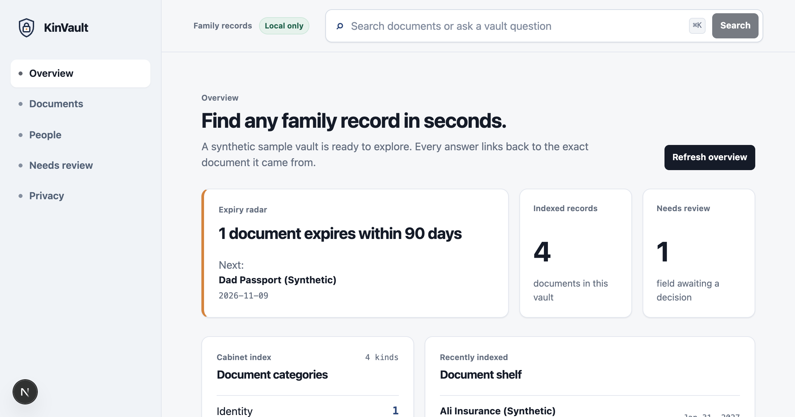

  
  <h1>KinVault</h1>
  
<strong>Find any family record in seconds — with its source.</strong>

  
A local-first family document vault for basic personal records. Each answer points to the exact document, page, field, and confidence behind it.

  

  

    <a href="https://m-nabeegh.github.io/kinvault/"><strong>Live showcase ↗</strong></a>
    &nbsp;·&nbsp;
    <a href="https://github.com/M-Nabeegh/kinvault">Source ↗</a>
    &nbsp;·&nbsp;
    <a href="#quick-start">Quick start</a>
  

  

    
    
    
    
  

> **Public demo boundary:** The showcase and seeded family are entirely synthetic. The full app runs locally; GitHub Pages is a static product tour and does not run SQLite, uploads, or deletion APIs.

## Why KinVault?

Families keep passports, identity cards, insurance records, school papers, vehicle documents, visas, certificates, and utility records in scattered places. KinVault makes those records easier to inspect without turning uncertainty into a confident-looking answer.

The product rule is simple:

> If the indexed documents do not support an answer, KinVault says **Not found in the vault**.

Every supported answer includes:

- the source document;
- the exact page;
- the extracted field and field ID;
- the value that was read;
- a confidence level, with a visible review request for uncertain extraction.

## Explore the showcase

**[Open the live GitHub Pages showcase →](https://m-nabeegh.github.io/kinvault/)**

The public page shows the visual system and a small synthetic Q&A flow. It also explains the privacy boundary, local architecture, and setup.

For the real local experience, clone the repository and run the app below.

## Quick start

Requirements: Node.js 20+ and npm.

### Run locally

~~~bash
git clone https://github.com/M-Nabeegh/kinvault.git
cd kinvault
npm install
npm run dev
~~~

Open \`http://127.0.0.1:3000\`.

The first run seeds four fictional records:

| Person / household | Record | Visible behavior |
| --- | --- | --- |
| Dad Rowan | Passport | Expiry answer with page 2 citation |
| Sana Rowan | Identity card | Low-confidence DOB routed to review |
| Ali Rowan | Insurance | Local expiry/category index |
| Rowan household | Utility record | Document without an expiry field |

Try:

1. Ask **“When does Dad’s passport expire?”**
2. Open the cited source field.
3. Visit **People** for document timelines.
4. Visit **Needs review** and correct the uncertain DOB.
5. Upload a synthetic text fixture from **Documents**.
6. Visit **Privacy** to stream an export or use the exact confirmation controls.

## Product surface

| Surface | What it does |
| --- | --- |
| **Overview** | Expiry radar, category counts, recent records, and review count. |
| **Spotlight Q&A** | Deterministic supported questions, keyword search, confidence, and citations. |
| **Documents** | Local upload, MIME/size/policy checks, filters, and field-level source preview. |
| **People** | Person profiles with document timelines and source-field links. |
| **Needs review** | Accept, correct, or dismiss uncertain extraction without losing original provenance. |
| **Privacy** | Local-only explanation, streamed ZIP export, document deletion, and exact vault deletion confirmation. |

## Architecture

~~~mermaid
flowchart LR
  UI["Next.js App Router UI"] --> ROUTES["Local route handlers"]
  ROUTES --> ANSWERS["Deterministic answer service"]
  ROUTES --> REPO["SQLite metadata repository"]
  REPO --> FIELDS["Extracted fields + provenance"]
  ROUTES --> STORAGE["Guarded local vault root"]
  STORAGE --> EXTRACT["Offline extraction interface"]
~~~

The main boundaries are intentionally small:

- \`app/\`: pages and local route handlers;
- \`components/\`: Finder-inspired UI, Spotlight Q&A, source preview, people, review, upload, privacy;
- \`src/domain/\`: expiry math, question parsing, citations, sensitive-data policy;
- \`src/data/\`: SQLite schema, repository, synthetic seed;
- \`src/services/\`: answer, extraction, safe storage, ingestion, review, export/delete coordination;
- \`site/\`: static GitHub Pages showcase.

## Privacy and security model

KinVault is local-first by default:

- no external account or sign-in flow;
- no paid API, external OCR, analytics, or remote storage request;
- SQLite stores metadata; original files stay under the configured vault root;
- absolute paths, traversal, and symlink escape are rejected;
- payment-card-like content is rejected while ordinary identity/insurance records remain supported;
- all public fixture data is synthetic;
- deletion is explicit and permanent in this v1 demo.

“Local” is a design boundary, not a security certification. V1 does not provide encryption-at-rest, authentication, backup/restore, multi-device sync, malware scanning, or regulatory certification.

## Provenance contract

The answer service never invents a value. The source contract carries:

~~~ts
type SourceCitation = {
  documentId: string;
  documentTitle: string;
  fieldId: string;
  page: number;
  field: string;
  value: string;
  confidence: number;
};
~~~

Low-confidence fields are placed in **Needs review**. Corrections update the stored value while retaining the original page and source text.

## Quality gate

~~~bash
npm test
npm run typecheck
npm run lint
npm run build
~~~

The repository includes tests for:

- inclusive expiry windows and calendar boundaries;
- complete source citations and duplicate-label safety;
- missing/unsupported answers;
- payment-card rejection and overlength digit boundaries;
- path traversal, absolute paths, and symlink escapes;
- idempotent/recoverable synthetic seeding;
- upload policy-before-storage behavior;
- review provenance and exact confirmation payloads;
- streaming export metadata/path safety.

## GitHub Pages vs. the real app

GitHub Pages serves the static showcase at [m-nabeegh.github.io/kinvault](https://m-nabeegh.github.io/kinvault/). The page demonstrates the visual language and synthetic Q&A contract. It does not run SQLite or write local files.

For the complete product flow, including upload, local metadata, source preview, review decisions, export, and deletion, use the local setup above.

## Limitations and next adapters

V1 uses an in-memory metadata database and deterministic fixture extraction. It accepts small text fixtures rather than arbitrary scanned PDFs/images. It does not encrypt storage, authenticate users, sync devices, or provide undo after deletion.

Possible next adapters:

- persistent SQLite file and encrypted vault;
- offline OCR provider behind \`ExtractionService\`;
- backup/restore with explicit key ownership;
- multi-user access controls;
- document parsers for PDFs and images.

## Engineering scope

The codebase is organized into small, testable boundaries: domain contracts,
SQLite and safe storage, cited answers, the dashboard, provenance handling,
privacy controls, streaming export, and Pages publishing each live in their own
module with dedicated tests.

## License

MIT. Designed and engineered by **Muhammad Nabeegh**.
